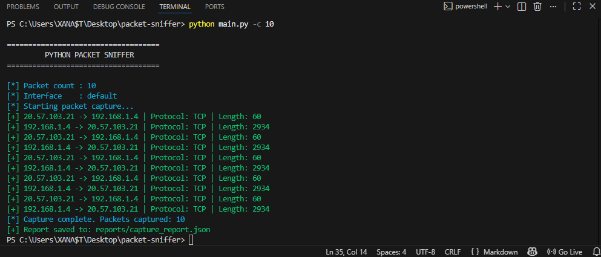

# Python Packet Sniffer

A Python packet sniffer built with Scapy for basic network traffic capture, protocol filtering, packet analysis, and reporting.

This project demonstrates live packet capture, protocol-aware filtering, packet parsing, export capabilities, and network traffic summarization in authorized environments.

---

## Features

- Live packet capture
- Source and destination IP parsing
- Protocol detection (TCP, UDP, ICMP)
- Protocol filtering (`all`, `tcp`, `udp`, `icmp`)
- Network interface listing
- Packet length display
- Capture statistics summary
- JSON report export
- Optional CSV export
- Optional PCAP export for Wireshark
- Colored CLI output

---

## Project Structure

```text
packet-sniffer
│
├── assets
│   └── example.png
│
├── sniffer
│   ├── __init__.py
│   └── packet_sniffer.py
│
├── utils
│   ├── __init__.py
│   ├── console.py
│   ├── parser.py
│   ├── reporter.py
│   └── validator.py
│
├── main.py
├── requirements.txt
├── .gitignore
└── README.md
```

## Example Output

<<<<<<< HEAD

=======

>>>>>>> 2ac6203 (Upgrade packet sniffer with interface listing, protocol filtering, stats summary, CSV and PCAP export)
